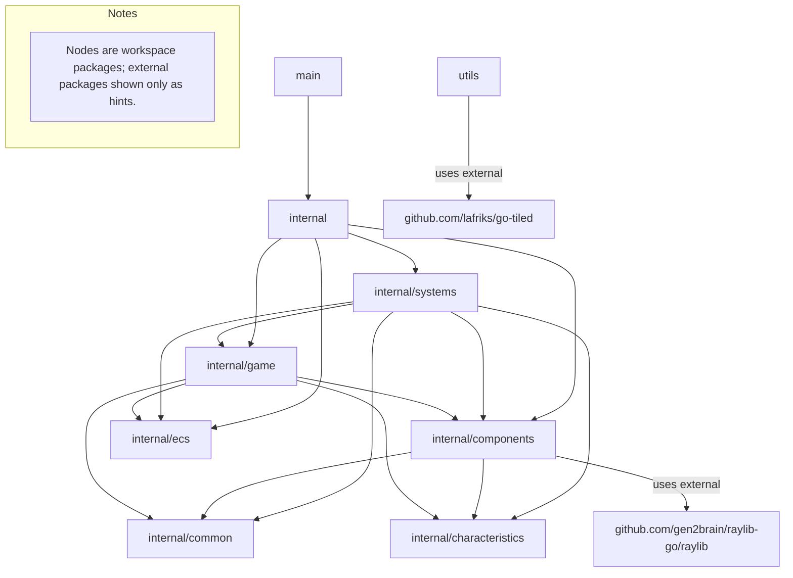

```mermaid
graph TD

  %% Package nodes (workspace-relative)
  int_common["internal/common"]
  int_components["internal/components"]
  int_ecs["internal/ecs"]
  int_game["internal/game"]
  int_systems["internal/systems"]
  int_characteristics["internal/characteristics"]
  int_root["internal"]
  main_pkg["main"]
  utils_pkg["utils"]

  %% Edges: who imports whom (internal -> internal)
  int_game --> int_characteristics
  int_game --> int_common
  int_game --> int_components
  int_game --> int_ecs

  int_components --> int_common
  int_components --> int_characteristics

  int_systems --> int_common
  int_systems --> int_components
  int_systems --> int_ecs
  int_systems --> int_game
  int_systems --> int_characteristics

  int_root --> int_components
  int_root --> int_ecs
  int_root --> int_game
  int_root --> int_systems

  main_pkg --> int_root

  %% Utilities and external deps (omitted detailed external graph)
  utils_pkg -->|uses external| lafriks_tiled["github.com/lafriks/go-tiled"]
  int_components -->|uses external| raylib["github.com/gen2brain/raylib-go/raylib"]

  %% Legend
  subgraph Notes
    direction TB
    note["Nodes are workspace packages; external packages shown only as hints."]
  end

```